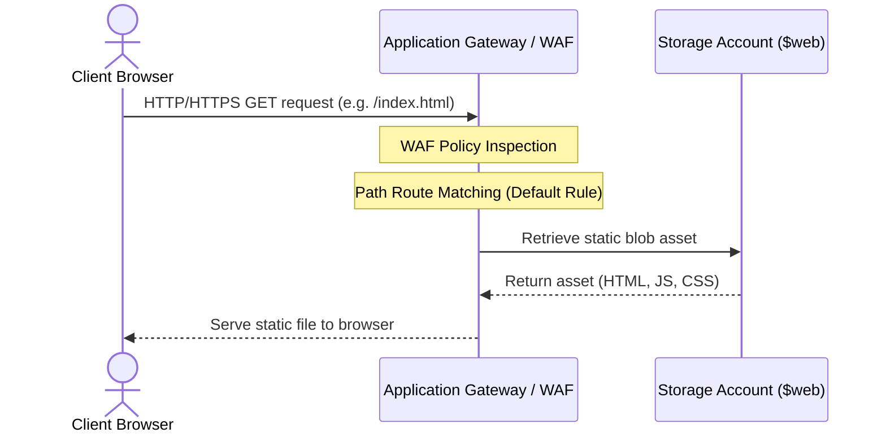
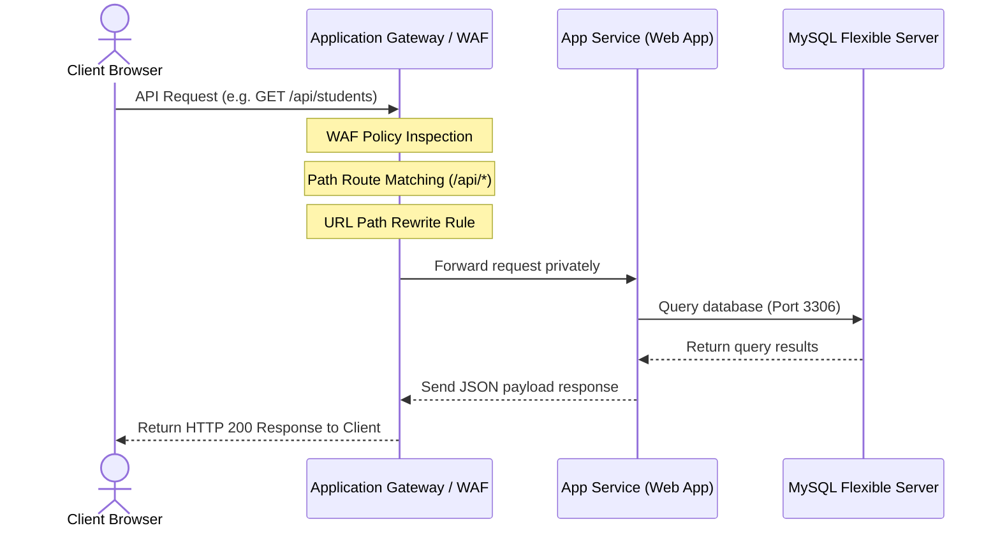

# Terraform-Based 3-Tier Application on Microsoft Azure

## 1. Objective
The objective of this project is to provision and manage a secure, scalable, and modular 3-tier application architecture on Microsoft Azure using Terraform. 

The infrastructure is implemented following Infrastructure as Code (IaC) principles to provide:
* **Reusability**: Organized into distinct, independent Terraform modules under the `modules/` directory.
* **Scalability**: Decoupled tiers allowing independent scaling of frontend hosting, backend application instances, and database capacity.
* **Maintainability**: Clear separation of resource declarations, environment configurations, and secrets management.
* **Security**: Network isolation via dedicated subnets, Network Security Groups (NSGs), private database access, Web Application Firewall (WAF) protection, and secure secrets resolution.
* **Consistent Deployments**: Replicable environment builds using parameterized input variables.

---

## 2. Architecture Overview
The deployed solution implements a robust 3-tier cloud infrastructure consisting of the following integrated layers:

```mermaid
graph TD
    User([User / Internet]) -->|HTTP / HTTPS| AppGW[Application Gateway / WAF]
    
    subgraph Virtual Network (VNet)
        direction TB
        subgraph Subnet: App Gateway
            AppGW
        end
        
        subgraph Subnet: Backend Web App
            Backend[App Service: Backend Node.js Web App]
        end
        
        subgraph Subnet: Private Database
            DB[(Azure Database for MySQL Flexible Server)]
        end
    end
    
    AppGW -->|Path: /*| Storage[(Azure Storage Account: Static Frontend)]
    AppGW -->|Path: /api/*| Backend
    Backend -->|Private Query| DB
    
    subgraph Registry & Security
        ACR[Azure Container Registry]
        KV[Azure Key Vault]
    end
    
    Backend -->|Pull Docker Image| ACR
    Backend -->|Managed Identity Auth| KV
    AppGW -->|Managed Identity Auth| KV
```

* **Networking Layer**: Provides network isolation and private connectivity between components inside a Virtual Network (VNet) using dedicated subnets and Network Security Groups (NSGs).
* **Edge Layer**: Azure Application Gateway (using `Standard_v2` or `WAF_v2` SKU) acts as the public entry point. It manages public ingress, executes path-based routing, terminates SSL, redirects HTTP traffic to HTTPS, and hosts custom error pages. When WAF is enabled, it provides Layer-7 web application protection.
* **Application Layer**: Azure Linux App Service Web App running containerized Node.js/Express backend services, integrated directly into the VNet for outbound database access.
* **Database Layer**: Azure Database for MySQL Flexible Server hosting persistent relational data. The database is fully isolated within a delegated subnet, relying on Private DNS Zone integration.
* **Frontend Layer**: Azure Storage Account Static Website hosting the compiled React application, accessed securely as a backend origin by the Application Gateway.
* **Registry Layer**: Azure Container Registry (ACR) hosting container images. The App Service securely retrieves images via a System-Assigned Managed Identity.
* **Secrets Layer**: Azure Key Vault storing sensitive credentials (e.g. database password) and SSL certificates. Access is controlled via Role-Based Access Control (RBAC) and User/System-Assigned Managed Identities.
* **Monitoring Layer**: Azure Log Analytics Workspace capturing diagnostics and activity logs for the Application Gateway.

---

## 3. Architecture Components

### Virtual Network (VNet)
Logical network separation is configured via a Virtual Network (`vnet-srs-prod`) divided into three specialized subnets:

| Subnet | Name | Default Address Prefix | Purpose |
| :--- | :--- | :--- | :--- |
| **Application Gateway Subnet** | `subnet-appgw-srs-prod` | `10.0.1.0/24` | Dedicated subnet for Application Gateway public endpoint. |
| **Backend Subnet** | `subnet-backend-srs-prod` | `10.0.2.0/24` | Dedicated subnet for Linux Web App regional VNet integration. |
| **Database Subnet** | `subnet-db-srs-prod` | `10.0.3.0/24` | Delegated subnet for MySQL Flexible Server private access. |

### Application Gateway Layer
Azure Application Gateway acts as the gateway controller, offering:
* **Public IP Access**: Linked to a static, standard public IP.
* **Optional WAF Policy**: Operates in `Prevention` mode using the OWASP 3.2 ruleset to block SQL injection, cross-site scripting, and other Layer-7 exploits.
* **SSL Termination & HTTPS Redirection**: Supports HTTPS binding using a certificate sourced from Key Vault. Automatically redirects insecure HTTP traffic to HTTPS.
* **Path-Based Routing Rules**:
  
  | Path | Target Backend Pool | Protocol & Port | Health Probe |
  | :--- | :--- | :--- | :--- |
  | `/api/*` | Backend Node.js App Service | HTTPS / 443 | `/health` endpoint |
  | `/` (Default) | Frontend Storage Account (Static Website) | HTTPS / 443 | Default Settings |

* **Custom Errors**: Custom 403 (Forbidden) and 502 (Bad Gateway) HTML pages are hosted in the Storage Account and mapped directly in the App Gateway configuration.
* **Health Probes**: Probes the backend Web App every 30 seconds at `/health`.

### Application Layer
The backend application is hosted in a containerized environment:
* **Linux App Service Plan**: Set to standard `B1` SKU to support VNet Integration (can toggle to `F1` for basic HTTP testing).
* **Linux Web App**: Hosts the backend Docker image retrieved from the Azure Container Registry.
* **Regional VNet Integration**: Directs all outbound web app traffic into the backend subnet (`subnet-backend-srs-prod`), enabling private connectivity to the MySQL database.
* **System-Assigned Managed Identity**: Granted the `AcrPull` role on the Container Registry and `Key Vault Secrets User` permissions on Key Vault, eliminating hardcoded access keys.
* **Runtime App Settings**:
  * `DB_HOST`: Private database hostname resolved via private DNS.
  * `DB_USER`: Administrative database username.
  * `DB_PASSWORD`: Secure versionless Key Vault secret reference.
  * `DB_NAME`: Database schema name.
  * `PORT` / `WEBSITES_PORT`: Container listening port (default: `5000`).
  * `DOCKER_ENABLE_CI`: Set to `true` to enable continuous deployment triggers on image updates.

### Database Layer
Relational data is stored in a fully isolated database server:
* **Azure Database for MySQL Flexible Server**: Deployed on a cost-efficient standard SKU (`B_Standard_B1ms`).
* **Private Network Integration**: Delegated to the database subnet (`subnet-db-srs-prod`) with no public IP or public endpoints.
* **Private DNS Zone & Virtual Network Link**: Linked directly to the VNet to resolve the database's Fully Qualified Domain Name (FQDN) privately.
* **MySQL Database**: Provisions the default target database schema (`trainee_db`).

### Frontend Layer
Frontend assets are compiled and hosted serverlessly:
* **Azure Storage Account**: Static website hosting is enabled on the storage container.
* **Static Website Endpoint**: Serves React/Vite assets via the `$web` blob container.
* **Origin Shielding**: Direct access to the storage endpoint is bypassed by routing user requests through the Application Gateway.

### Secrets Management (Key Vault)
A pre-existing Azure Key Vault (`kv-srs-prod-cv`) is referenced as a data source:
* **Dynamic Credentials**: Database administrator passwords are resolved at deploy-time and passed safely.
* **User-Assigned Identity**: The Application Gateway uses a dedicated User-Assigned Managed Identity (`id-appgw-srs-prod`) to access Key Vault and retrieve SSL certificates.
* **Role Assignments**: Managed identities are granted granular access roles (e.g. `Key Vault Secrets User`).

### Monitoring & Telemetry
Diagnostic settings are configured for proactive monitoring:
* **Log Analytics Workspace**: Centralizes system event data.
* **App Gateway Diagnostics**: Sends `ApplicationGatewayAccessLog`, `ApplicationGatewayPerformanceLog`, and `ApplicationGatewayFirewallLog` streams directly to Log Analytics.

---

## 4. Repository Structure
The Terraform code is organized using a clean, modular structure:

```
terraform/
├── modules/
│   ├── acr/                      # Azure Container Registry module
│   │   ├── main.tf
│   │   ├── variables.tf
│   │   └── outputs.tf
│   ├── appgateway/               # Application Gateway & WAF module
│   │   ├── main.tf
│   │   ├── variables.tf
│   │   └── outputs.tf
│   ├── backend-app/              # App Service & Web App module
│   │   ├── main.tf
│   │   ├── variables.tf
│   │   └── outputs.tf
│   ├── database/                 # MySQL Flexible Server & Private DNS module
│   │   ├── main.tf
│   │   ├── variables.tf
│   │   └── outputs.tf
│   ├── monitoring/               # Log Analytics & Diagnostics module
│   │   ├── main.tf
│   │   ├── variables.tf
│   │   └── outputs.tf
│   └── networking/               # VNet, Subnets, and NSGs module
│       ├── main.tf
│       ├── variables.tf
│       └── outputs.tf
├── main.tf                       # Provider config, RG, data sources, module orchestrator
├── variables.tf                  # Global input variables
├── outputs.tf                    # Core CLI outputs and helper commands
├── terraform.tfvars.example      # Sample variable file for local use
└── backend.hcl.example           # Template for remote backend state storage
```

---

## 5. Module Descriptions

### 1. Networking Module (`modules/networking`)
Responsible for establishing the core networking topology and access-control rules.
* **Resources Managed**: Virtual Network, Subnets (App Gateway, Backend, DB), Network Security Groups, NSG associations.
* **Key NSG Inbound Security Rules**:
  * **App Gateway NSG**: Allows HTTP (80) & HTTPS (443) from `Internet` and management ports (`65200-65535`) from `GatewayManager`.
  * **Backend NSG**: Restricts inbound TCP traffic to HTTP/HTTPS ports, allowing access *only* from the Application Gateway subnet prefix.
  * **Database NSG**: Allows inbound traffic on port `3306` (MySQL) *only* from the Backend App Service subnet prefix, with a catch-all deny rule for all other sources.
* **Outputs**:
  * `vnet_id`: Virtual Network ID.
  * `appgw_subnet_id`: AGW subnet resource ID.
  * `backend_subnet_id`: Backend integration subnet resource ID.
  * `db_subnet_id`: Database delegated subnet resource ID.

### 2. Database Module (`modules/database`)
Provisions the private relational database cluster.
* **Resources Managed**: MySQL Flexible Server, MySQL Database, Private DNS Zone, VNet Link, Firewall rule to allow internal Azure services.
* **Outputs**:
  * `id`: MySQL Server ID.
  * `name`: MySQL Server Name.
  * `hostname`: Private FQDN of the database.
  * `database_name`: Name of the database schema.

### 3. App Service Module (`modules/backend-app`)
Deploys the backend application layer.
* **Resources Managed**: App Service Plan, Linux Web App, App Settings configurations.
* **Outputs**:
  * `id`: Linux Web App resource ID.
  * `name`: Web App Name.
  * `default_hostname`: App Service default URL.
  * `principal_id`: System-assigned principal ID for Key Vault and ACR authorization.

### 4. Application Gateway Module (`modules/appgateway`)
Controls ingress routing, security policies, and WAF protection.
* **Resources Managed**: User-Assigned Managed Identity, Public IP, Application Gateway, WAF policy (optional), role assignments.
* **Outputs**:
  * `id`: Application Gateway resource ID.
  * `name`: Application Gateway Name.
  * `public_ip`: Public IP Address.
  * `identity_principal_id`: User-assigned identity principal ID.

### 5. Container Registry Module (`modules/acr`)
Manages the Docker registry.
* **Resources Managed**: Azure Container Registry (ACR) basic tier.
* **Outputs**:
  * `id`: ACR ID.
  * `name`: ACR Name.
  * `login_server`: ACR Login Server URL.

### 6. Monitoring Module (`modules/monitoring`)
Configures diagnostics logging.
* **Resources Managed**: Log Analytics Workspace, Monitor Diagnostic Setting.
* **Outputs**:
  * `workspace_id`: Log Analytics Workspace ID.
  * `workspace_name`: Log Analytics Workspace Name.

---

## 6. Terraform State Management
To ensure state reliability, consistency, and concurrency control in multi-developer environments:
* **Remote Backend**: Terraform state is stored remotely in an Azure Storage Account container (`tfstate`).
* **Backend Configuration**: Defined inside the root `terraform` block:
  ```hcl
  terraform {
    backend "azurerm" {}
  }
  ```
* **State Isolation**: Environment-specific state files are managed by passing distinct key arguments during initialization:
  * Development: `dev.terraform.tfstate`
  * Production: `prod.terraform.tfstate`
* **Locking**: Azure Blob Storage handles write locks automatically to prevent concurrent execution conflicts.

---

## 7. Environment Configuration
Environment parameters are stored separately inside environment-specific configurations:
* **Configuration Files**:
  * Development: Configure locally inside `terraform.tfvars` (modeled after [terraform.tfvars.example](file:///h:/test/trainee_repo/terraform/terraform.tfvars.example)).
* **Configured Variables**:
  * `environment`: Environment classification (e.g. `dev`, `prod`).
  * `location`: Target Azure deployment region (e.g. `centralindia`).
  * `sku` values: Database and App Service pricing tiers.
  * `tags`: Project tag definitions.
  
> [!IMPORTANT]
> Secrets (such as database administrative passwords or subscription IDs) must never be committed to repository variables or `.tfvars` files.

---

## 8. Secrets Management
The architecture ensures zero plain-text secrets are committed or stored in configuration files:

1. **Deployment Phase**:
   Terraform fetches pre-existing secrets dynamically from Azure Key Vault using data sources:
   ```hcl
   data "azurerm_key_vault_secret" "db_password" {
     name         = "db-password"
     key_vault_id = data.azurerm_key_vault.main.id
   }
   ```
2. **Runtime Integration**:
   Instead of outputting the password value directly to the Web App configuration, a versionless Key Vault Reference is built and assigned:
   ```hcl
   locals {
     kv_db_password_ref = "@Microsoft.KeyVault(SecretUri=${data.azurerm_key_vault_secret.db_password.versionless_id})"
   }
   ```
   The application environment variable resolves the secret value dynamically at runtime using the Web App's System-Assigned Managed Identity.

---

## 9. Request Flow

### Frontend Assets Flow


### Backend API Request Flow


---

## 10. Security Implementation

> [!NOTE]
> The security framework implemented in this infrastructure complies with enterprise cloud isolation best practices.

* **Network Isolation**: The three tiers (Web, Application, Database) are hosted on distinct subnets with custom NSGs restricting cross-subnet traffic to only the required ports.
* **WAF Layer-7 Protection**: The Application Gateway's WAF capability filters traffic against the OWASP Core Rule Set (CRS 3.2), preventing application vulnerabilities from reaching downstream services.
* **Private Connectivity**: The database server possesses no public IP address and resides behind a delegated integration subnet, accessible solely from within the VNet.
* **Managed Identity and Least Privilege**: Access policies and RBAC roles (like `Key Vault Secrets User` and `AcrPull`) are assigned exclusively to Azure Managed Identities, eliminating credentials in code files.
* **Secret Vault Isolation**: Key Vault stores credentials and certificates. They are resolved via secure reference templates at runtime, ensuring they remain encrypted at rest and in transit.

---

## 11. Key Features Implemented
* **Modular Infrastructure as Code**: Written as highly reuseable modules facilitating multi-environment architecture replication.
* **Secure Remote Backend State**: Features Azure Storage Account remote backend with locking mechanisms.
* **Path-Based Reverse Proxy**: App Gateway routes traffic to either storage accounts (frontend) or App Services (backend) based on the URL path.
* **Integrated WAF Firewall**: Embedded web security shield protecting application layers.
* **Managed Identity Service Authentication**: Direct role-based authentication between Web App, ACR, and Key Vault.
* **Fully Private Database Architecture**: Database hosting with private DNS resolution.
* **Automatic HTTPS Redirection**: Redirects insecure inbound HTTP requests to secure HTTPS endpoints.
* **Diagnostics Collection**: Dedicated Log Analytics setup for ingress performance and security logging.

🚀 Full Infrastructure Setup — Step by Step
# ── 0. PREREQUISITES ─────────────────────────────────────────────────────────
az login && az account set --subscription "<YOUR_SUBSCRIPTION_ID>"

# ── 1. CREATE RESOURCE GROUPS ─────────────────────────────────────────────────
az group create --name rg-tfstate --location centralindia && az group create --name rg-srs-prod --location centralindia && az group create --name rg-srs-dev --location centralindia

# ── 2. CREATE TERRAFORM REMOTE BACKEND STORAGE ───────────────────────────────
az storage account create --name <BACKEND_STORAGE_NAME> --resource-group rg-tfstate --location centralindia --sku Standard_LRS --kind StorageV2 --min-tls-version TLS1_2 && az storage container create --name tfstate --account-name <BACKEND_STORAGE_NAME>

# ── 3. CREATE KEY VAULTS ──────────────────────────────────────────────────────
az keyvault create --name kv-srs-prod-cv --resource-group rg-srs-prod --location centralindia --sku standard --enable-rbac-authorization true
az keyvault create --name kv-srs-dev-cv --resource-group rg-srs-dev --location centralindia --sku standard --enable-rbac-authorization true

# ── 4. ADD DB PASSWORD SECRETS TO KEY VAULTS ─────────────────────────────────
az role assignment create --role "Key Vault Administrator" --assignee "<YOUR_USER_OBJECT_ID>" --scope $(az keyvault show --name kv-srs-prod-cv --query id -o tsv) && az keyvault secret set --vault-name kv-srs-prod-cv --name "db-password" --value "<PROD_DB_PASSWORD>"
az role assignment create --role "Key Vault Administrator" --assignee "<YOUR_USER_OBJECT_ID>" --scope $(az keyvault show --name kv-srs-dev-cv --query id -o tsv) && az keyvault secret set --vault-name kv-srs-dev-cv --name "db-password" --value "<DEV_DB_PASSWORD>"

# ── 5. CREATE FRONTEND STORAGE ACCOUNTS ──────────────────────────────────────
az storage account create --name storagesrsprod --resource-group rg-srs-prod --location centralindia --sku Standard_LRS --kind StorageV2 --min-tls-version TLS1_2 && az storage blob service-properties update --account-name storagesrsprod --static-website --index-document index.html --404-document index.html
az storage account create --name storagesrsdev --resource-group rg-srs-dev --location centralindia --sku Standard_LRS --kind StorageV2 --min-tls-version TLS1_2 && az storage blob service-properties update --account-name storagesrsdev --static-website --index-document index.html --404-document index.html

# ── 6. DEPLOY PROD (owns the shared ACR — must go first) ─────────────────────
cd terraform/environments/prod && cp terraform.tfvars.example terraform.tfvars && cp backend.hcl.example backend.hcl
# → Edit terraform.tfvars and backend.hcl with your real values, then:
terraform init -backend-config=backend.hcl && terraform plan -var-file=terraform.tfvars && terraform apply -var-file=terraform.tfvars
terraform output shared_acr_name   # Copy this value for step 7

# ── 7. DEPLOY DEV (references prod ACR) ──────────────────────────────────────
cd ../dev && cp terraform.tfvars.example terraform.tfvars && cp backend.hcl.example backend.hcl
# → Set acr_name = output from step 6, fill remaining values, then:
terraform init -backend-config=backend.hcl && terraform plan -var-file=terraform.tfvars && terraform apply -var-file=terraform.tfvars

# ── 8. BUILD & PUSH BACKEND DOCKER IMAGE ─────────────────────────────────────
az acr build --registry <ACR_NAME> --image trainee-backend:latest ./trainee_backend   # prod
az acr build --registry <ACR_NAME> --image trainee-backend:dev ./trainee_backend      # dev

# ── 9. BUILD & UPLOAD REACT FRONTEND ─────────────────────────────────────────
cd trainee_frontend && npm install && npm run build && cd ..
az storage blob upload-batch --account-name storagesrsprod --source ./trainee_frontend/dist --destination '$web' --overwrite   # prod
az storage blob upload-batch --account-name storagesrsdev  --source ./trainee_frontend/dist --destination '$web' --overwrite   # dev

# ── 10. GET YOUR PUBLIC IP ────────────────────────────────────────────────────
cd terraform/environments/prod && terraform output app_gateway_ip   # → point DNS A record here
